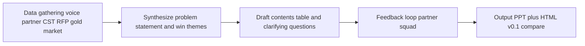
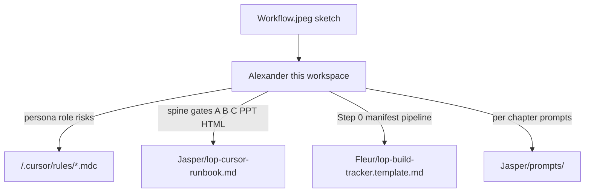

# Workflow from sketch

Transcription of **[`../Workflow.jpeg`](../Workflow.jpeg)** (team whiteboard). Use this page to tie the sketch to repo rules and the Jasper runbook — rules remain authoritative where they differ in wording.

**How to run the workflow without code:** follow **[`instructions/playbook-from-sketch.md`](instructions/playbook-from-sketch.md)** (step-by-step in Cursor + Markdown).

---

## Persona

- Structured  
- Output focused  
- Expert always available  

## Role

- Assistant / fellow LoP building  

## Scenario

- **Beach resource:** Limited context, tight timeline, asked to deliver a strong LoP.  
- **Partners:** Have context, limited time.  

## Transformation area

- Beach resource / client development  

## Evaluation

Metrics called out on the sketch:

- Win rate  
- Time saved  
- Quality of output  
- Time spent  
- Audit  

*(Track qualitatively unless baselines exist — see [`../../.cursor/rules/lop-builder-tools-data.mdc`](../../.cursor/rules/lop-builder-tools-data.mdc).)*  

## Agent guidance (sketch wording)

An agent that helps speed up high-standard LoP generation, gathering CST and client input.

## Output

- Winning LoP  
- **`.ppt` / HTML**  

Aligned with v0.1 deliverables in [`../Jasper/lop-cursor-runbook.md`](../Jasper/lop-cursor-runbook.md).

## Risks and errors (sketch)

- Hallucination  
- Wrong prior input  
- Opposing inputs  

Mitigations: Step 0 manifest, evidence-bound chapters, HITL gates — [`../../.cursor/rules/lop-builder-core.mdc`](../../.cursor/rules/lop-builder-core.mdc), [`../Jasper/lop-cursor-runbook.md`](../Jasper/lop-cursor-runbook.md).

---

## Contents (LoP spine — sketch)

1. Context & objectives  
2. Why McKinsey? *(sketch note: “Have we done this 100x?”)*  
3. Team  
4. Credentials  
5. Market trends  
6. Approach  
7. Fees  
8. Appendix  
9. References  
10. Team CVs  

*Rules checklist also includes “Timeline and team” as its own section — follow [`../../.cursor/rules/lop-builder-workflow.mdc`](../../.cursor/rules/lop-builder-workflow.mdc) when reconciling with tender/RFP structure.*

## Guidelines (sketch)

- Per chapter guidelines  
- Best practices  
- Stakeholders  
- Specific sources  

## Process flow (sketch — vertical narrative)

1. **Human:** Data gathering — voice inputs (~7 mins, per sketch)  
2. **Squad:** Synthesizing → problem statement  
3. **Draft output:** Clarifying questions, contents table  
4. **Feedback loop**  
5. **Output**  

**Progress tracker** — noted on sketch; use [`../Fleur/lop-build-tracker.template.md`](../Fleur/lop-build-tracker.template.md) copied per pursuit.

### Process flow (diagram)

---

## Our workflow (handwritten on sketch — verbatim)

workplan -> information gathering -> identify agents -> divide work -> work on elements -> review / iterate  

*(Overlaps the tracker “Pipeline status” and runbook cadence — [`../Fleur/lop-build-tracker.template.md`](../Fleur/lop-build-tracker.template.md).)*  

---

## Tools (sketch)

- LOP coach to check output  
- PPT / Excel / HTML  
- Connections to Know / MUI *(treat as Know/MVI per firm naming — only if configured)*  
- Connections to web  
- Voice to text  
- Email connection  

See [`../../.cursor/rules/lop-builder-tools-data.mdc`](../../.cursor/rules/lop-builder-tools-data.mdc) for what to assume in v0.1.

## Data sources (sketch)

- Best-practice LoPs — competitive vs non-competitive, exploratory, relationship-building  
- Tenders / RFP  
- CST context / previous work  
- Partner input  
- Market input  

---

## Sketch → workspace mapping

How this canvas connects to files you actually use:

| Sketch block | Primary anchor |
|--------------|----------------|
| Persona / risks | [`lop-builder-core.mdc`](../../.cursor/rules/lop-builder-core.mdc) |
| Spine / cadence | [`lop-builder-workflow.mdc`](../../.cursor/rules/lop-builder-workflow.mdc) |
| Tools / data / evaluation | [`lop-builder-tools-data.mdc`](../../.cursor/rules/lop-builder-tools-data.mdc) |
| Gates & chapter policy | [`../Jasper/lop-cursor-runbook.md`](../Jasper/lop-cursor-runbook.md) |
| Tracker & HITL | [`../Fleur/lop-build-tracker.template.md`](../Fleur/lop-build-tracker.template.md) |
