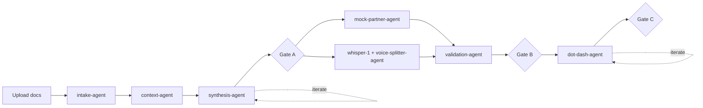

# Agents inventory — LoP Builder Phase 1

_Snapshot: 2026-05-02_

Specs live in [`agents/`](../agents/), are loaded by `load_agent_spec` in [`src/orchestrator.py`](../src/orchestrator.py) (lines 51-100), and invoked through `run_agent(name, ...)` (lines 198-242). Each `*.md` exposes two machine-readable sections to the orchestrator: `## System Prompt` (behaviour) and `## Output Schema` (JSON contract). Anything else in the spec is human-only.

## Pipeline

## The seven agents

| # | Agent | What it does | Output schema | Called from |
|---|---|---|---|---|
| 1 | `intake-agent` | Reads RFPs / RFIs / best-practice LoPs, classifies content across the nine LoP chapters, extracts key facts and RFP requirements, emits a gap list. | `IntakePackage` | `src/app.py` line 382 (Step 1) |
| 2 | `context-agent` | Adds company profile, market trends, competitive landscape, sector challenges — all from model knowledge, every claim labelled, plus an `evidence_gaps` list to validate. | `ContextDoc` | `src/app.py` line 451 (Step 2) |
| 3 | `synthesis-agent` | Merges intake + context into synthesis brief, problem statement, win themes, and the Gate A partner question list. Has a revision mode for Gate A iterate-with-notes. | `SynthesisDoc` | `src/app.py` lines 507 (Step 3) and 653 (Gate A revision) |
| 4 | `mock-partner-agent` | Simulates a senior partner's spoken answers, deliberately uneven (~50-60% complete, 25-30% partial, 10-20% missing). **Test utility** — remove once a real partner is in the loop. | `AnswerList` | `src/mock_answers.py` line 39 (Step 4) |
| 5 | `voice-splitter-agent` | Routes a consolidated whisper-1 transcript into one answer per `question_id`. Lightly cleans filler, never paraphrases or invents content. Empty string for questions the memo didn't cover. | `AnswerList` | `src/voice_answers.py` line 68 (Step 4) |
| 6 | `validation-agent` | Audits each answer for completeness, proposes follow-up questions for gaps, emits go/no-go verdict (`can_proceed_to_dot_dash`) plus blockers. Drives Gate B. | `ValidationReport` | `src/app.py` line 1041 (Step 5) |
| 7 | `dot-dash-agent` | Produces the LoP storyline — for each chapter a "dot" (insight headline) and 3-5 "dashes" (supporting points). Sets `confidence` per slide based on the validation report. Has a revision mode for Gate C iterate-with-notes. | `DotDashDoc` | `src/app.py` lines 1238 (Step 6) and 1429 (Gate C revision) |

Schemas: [`src/schemas.py`](../src/schemas.py).

## Where to iterate

- **Behaviour, tone, hard rules, quality bar** → edit `## System Prompt` in the agent's `.md` file. No code changes needed.
- **Adding/removing/renaming a field** → edit `## Output Schema` in the `.md` AND the matching pydantic model in [`src/schemas.py`](../src/schemas.py) AND every call-site that reads or builds that field.
- **What the agent receives** → edit the `user_message` string at the call-site in `src/app.py`, `src/mock_answers.py`, or `src/voice_answers.py` (this is the runtime payload; the spec is static).

## Iteration log

| Date | Agent | Change | Why |
|---|---|---|---|
| _yyyy-mm-dd_ | _agent-name_ | _what changed_ | _what gap it closes_ |
