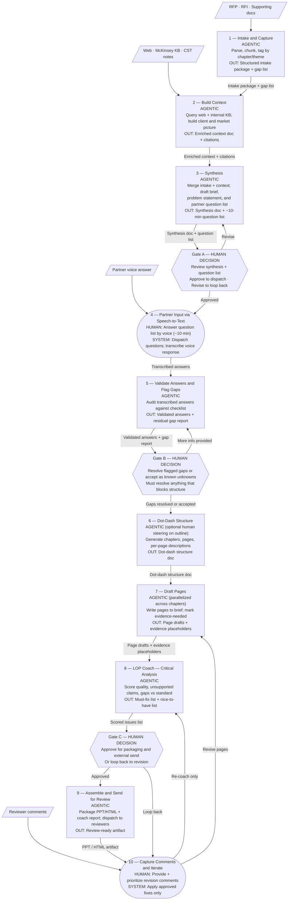

# Workplan: Agentic LoP workflow (from agentic solution input)

This plan translates [agentic_solution_input_transcription.md](agentic_solution_input_transcription.md) into a **build sequence**: what to align on first (agents, schemas, gates), then what to connect (tools), then how to measure success. It complements the Hamdi workspace layout (`../src/`, `../agents/`, `../workflows/`, `../tools/`, …) and is consistent in spirit with [Jasper LOP multi-agent design](../../Jasper/LOP-agent-workflow.md) and Pia's `lop_workflow` agents (reference only; no requirement to copy their code).

_Last refined: end-to-end workflow updated to 12-step model with partner speech-to-text loop, dot-dash structure step, and explicit gap-validation gate. Agent roster updated to match._

---

## 1) Objective (north star)

**Deliver a structured, always-available "fellow" system** that **accelerates high-standard Letter of Proposal (LoP) production** (PPT and/or HTML) for **beach or thin-context squads** and **tight timelines**, by:

- Systematically **ingesting and gap-checking** RFP and supporting documents before any drafting.
- **Building client and market context** (web + McKinsey knowledge base) to sharpen the problem statement.
- **Synthesizing** a brief, a problem statement, and a focused partner question list answerable in ~10 minutes via speech-to-text.
- **Validating** partner answers and flagging remaining gaps before committing to structure.
- **Drafting and iterating** via a strong dot-dash outline → page drafts → LOP coach → human review loop.
- **Reducing** failure modes: **hallucination**, **wrong prioritization of inputs**, and **opposing or conflicting inputs** (via explicit assumptions, source discipline, and human gates).

**Non-goals for v1 (unless you explicitly widen scope):** automating final client submission; guaranteed "win" claims; using connectors your environment does not actually provide.

---

## 2) End-to-end workflow (human + system) — 12 steps

**Shape legend:** `[/input/]` = human-provided input · `[step]` = fully agentic · `([step])` = human + system (human leads) · `{{gate}}` = HITL decision gate (hard block until resolved)

**Supporting artifact:** a **progress tracker** updated at each stage (align with [lop-build-tracker](../../Fleur/lop-build-tracker.template.md) pattern or a Hamdi-specific variant under `../workflows/`).

---

## 3) Required inputs and structuring guidance

**Content buckets to gather at intake (step 1):** RFP / RFI; context & objectives; why McKinsey and prior/comparable work (evidence-based only); team & credentials; market trends; approach; fees; appendix (references, CVs).

**Context sources used in step 2:** web search (market, competitor, client public info); McKinsey knowledge base / Know / MVI (only where tenant allows); CST notes; partner briefings.

**Structuring / policy inputs (applied at step 6 and to drafters at step 7):** per-chapter guidelines; best practices; stakeholder map; approved sources list. Version these under `../config/` and reference from the tracker.

**Tools implementation backlog:** voice-to-text transcriber (step 4); web connector (step 2); McKinsey KB connector (step 2); LOP coach (step 8); PPT/Excel/HTML assembler (step 9); email/dispatch connector (steps 4 and 9). Treat each as **optional stub** until confirmed available in your environment.

---

## 4) Agentic workflow: proposed agent roster

One **Orchestrator** sequences all steps and manages gate logic. Specialist agents own one step (or one concern) each. HITL gates are explicit blockers, not polite suggestions.

| Agent | Owns step(s) | Primary job | Key inputs | Key outputs | Iteration notes |
|--------|-------------|-------------|------------|-------------|-----------------|
| **Orchestrator** | All | Stage routing, gate management, escalation | User goals, constraints, gate decisions | Run-of-show; per-step briefs; open-issues log | Define chapter **dependency DAG** (e.g. approach after problem statement). |
| **Intake agent** | 1 | Ingest RFP + docs; produce gap list | RFP, RFI, supporting files | Structured intake package; **gap list** | Determines what is missing before any research begins. |
| **Context & research agent** | 2 | Enrich with web + internal KB | Intake package; gap list | Enriched context doc; citations; "evidence gap" flags | Web and KB access are **stubs** in v1 if connectors not yet wired. |
| **Synthesis agent** | 3 | Produce brief synthesis, problem statement, checklist, partner question list | Intake + enriched context | Synthesis doc; problem statement; checklist; **short question list** (~10 min) | Question list must be concise; design for voice answer. **Gate A** output. |
| **Dispatcher / voice-to-text** | 4 | Send questions; transcribe partner voice response | Question list; audio input | Transcribed partner answers | Tool-dependent; stub with plain-text answer for v1. |
| **Validation agent** | 5 | Audit transcribed answers; flag residual gaps | Transcribed answers; checklist | Validated answers; **residual gap report** | Gap report drives Gate B decision: resolve or accept-and-flag. |
| **Structure agent** | 6 | Build dot-dash outline: chapters, pages, per-page descriptions | Validated answers; guidelines; problem statement | Dot-dash structure doc (chapters + pages + strong descriptions) | This is the "skeleton" that all drafters work from; do not skip. |
| **Chapter drafter(s)** | 7 | Draft pages to brief | Dot-dash structure; guidance bundle; research pack | Page drafts + **evidence-needed** placeholders | Can parallelize across chapters where dependencies allow. |
| **LOP coach (critic)** | 8 | Critical analysis: quality, unsupported claims, gaps, standard | Full draft + source index | Scored issues list: **must-fix** vs nice-to-have | No new facts added here; surfaces gaps only. |
| **Assembler** | 9 | Package PPT / HTML for review | Patched draft; style tokens | PPT/HTML artifact | Pairs with export tools when wired. |
| **Revision agent** | 10 | Apply human-approved fixes; loop back to step 7 or 8 | Reviewer comments (human-prioritized); coach report | Revised draft | Applies **only** approved fixes to avoid infinite rewrite loops. |
| **Progress / tracker** | All | Maintain stage status and artifact log | Stage events | Updated tracker; exports path pointer | Aligns with lop-build-tracker pattern. |

**Gates summary:**

| Gate | Triggered after | What human decides | What blocks if not resolved |
|------|----------------|--------------------|-----------------------------|
| **Gate A** | Step 3 — synthesis + question list | Approve or revise synthesis and question list before dispatching to partner | Partner dispatch (step 4) |
| **Gate B** | Step 5 — validation | Accept residual gaps (flag in LOP) or resolve by providing missing info | Structure creation (step 6) |
| **Gate C** | Step 8 — LOP coach | Approve draft for external packaging and send, or loop back to revision | Assembly and dispatch (steps 9–10) |

---

## 5) Risks (from your doc) mapped to design controls

| Risk | Design control |
|------|----------------|
| **Hallucination** | Context agent cites sources; coach flags unsupported claims; assembler adds no new facts; evidence-needed placeholders are visible. |
| **Wrong prioritization of inputs** | Orchestrator + human align on must-win themes at Gate A; tracker shows priority and cut list. |
| **Opposing inputs** | Synthesis agent emits conflict note; Gate A forces resolution or explicit signed assumption before dispatching to partner. |
| **Partner answers too thin** | Validation agent flags gaps explicitly at step 5; Gate B forces resolution or acceptance before structure step. |

---

## 6) Evaluation (per your canvas)

Define **operational** proxies so you can measure before/after build:

- **Win rate** — pursuit-level; track in CRM/tracker, not in the agent alone.
- **Time saved** — wall-clock from intake to first reviewable draft; time spent in each gate.
- **Quality** — rubric: RFP alignment, evidence density, coach fault counts, human edit distance on revision.
- **Time spent** — by role (beach vs partner), by step.
- **Faults** — count by category (unsupported claim, wrong chapter, missing CV, format break, gap not flagged).

**Minimum:** a single tracker table in `../outputs/` with these columns updated per run.

---

## 7) Phased development workplan

**Phase 0 — Align (1–2 sessions)**
- Freeze chapter template, gate decision rules, and "evidence required" policy.
- Confirm tool availability: voice-to-text, web, McKinsey KB / Know / MVI.
- Resolve open canvas items: "voice 7 zones," "100x" phrasing (see [transcription section 13](agentic_solution_input_transcription.md)).
- Output: updated conops in `docs/` (this file + any clarification notes).

**Phase 1 — Spec agents (no integrations yet)**
- For each agent above: name, goal, input schema, output schema, failure behavior, downstream handoff.
- Store in [`../agents/`](../agents/) — one file per agent (markdown or YAML).
- Add [`../workflows/lop-hamdi-runbook.md`](../workflows/) — full DAG + gate checklist + owner map.

**Phase 2 — Spec tools (stubs)**
- In [`../tools/TOOL-INDEX.md`](../tools/) — tool name, owner agent, API shape, auth, PII rules, status (stub / live).
- Tier A (build first): voice-to-text, PPT/HTML export, file storage.
- Tier B: web connector, McKinsey KB / MVI.
- Tier C: email/dispatch connector.

**Phase 3 — Vertical slice (one pursuit, thin)**
- Run steps 1 → 3 → (manual partner Q&A stand-in) → 5 → 6 → 7 (one chapter) → 8 → static HTML.
- Prove gates and record evaluation metrics.

**Phase 4 — Widen and harden**
- Wire Tier A tools; parallel chapter drafters; full assembler; optional orchestration code under [`../src/`](../src/).

**Artifacts before heavy implementation:** (1) agent specs, (2) workflow DAG + gate checklist, (3) tool contract sheet (TOOL-INDEX), (4) evaluation tracker template.

---

## 8) Suggested file layout in Hamdi

- `docs/hamdi-agentic-lop-workplan.md` — this file.
- `docs/agentic_solution_input_transcription.md` — original canvas input.
- `workflows/lop-hamdi-runbook.md` — DAG, gate checklist, owner map.
- `agents/<agent-name>.md` or `.yaml` — one file per agent in the roster.
- `tools/TOOL-INDEX.md` — tool registry.
- `config/guidance-pointers.example.yaml` — non-secret pointers to per-chapter guidelines.
- `outputs/` / `runs/` — experiment artifacts (gitignored per `../.gitignore`).

---

## 9) What to iterate on next

- [ ] Confirm the 12 steps and gate placements with the squad.
- [ ] Decide: merge or split context agent and research agent (one agent vs two).
- [ ] Clarify "voice 7 zones" — literal chapter sections or a transcription artefact?
- [ ] Confirm which connectors (web, KB/MVI, voice-to-text) are available in your environment before Phase 1 specs.
- [ ] Define Gate B resolution: what is the acceptable level of gaps to proceed to structure?
- [ ] Decide whether the "dot-dash structure" (step 6) is a human-readable Markdown artefact, a YAML schema, or both.
- [ ] Assign success metric owners and decide where the tracker table lives.
