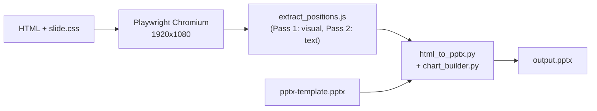

# html-pptx

Author PowerPoint slides as standard HTML, then compile to native PPTX.
Write any valid HTML/CSS with flexbox and grid layout -- the compiler
renders each slide in a headless Chromium browser, auto-detects visible
elements, and maps their computed positions to native PowerPoint shapes
on a firm template.

## Architecture



The pipeline has four stages:

1. **Render** -- Playwright opens each HTML file at a 1920x1080 viewport.
2. **Extract** -- `extract_positions.js` runs inside the page and walks the
   DOM under `.slide`, returning a JSON array of shape descriptors (tag,
   bounding rect, computed styles, text runs, chart JSON, etc.).
3. **Compile** -- `html_to_pptx.py` maps each descriptor to a python-pptx
   call: `add_shape`, `add_textbox`, `add_picture`, `add_chart`, or
   fills a template placeholder. Pixel positions become
   EMU coordinates.
4. **Output** -- the result is a standard `.pptx` editable in PowerPoint.

## Getting Started

### Prerequisites

- Python 3.10+
- Microsoft PowerPoint (Windows only, for the screenshot/inspection skill)

### Setup

Dependencies install automatically on first Cursor session (via the
`sessionStart` hook in `.cursor/hooks.json`). To run manually:

```bash
python scripts/setup.py
```

This creates a `.venv/` at the project root, installs Python packages from
`requirements.txt`, and downloads Chromium for Playwright.

### Compile Command

```bash
# PowerShell (Windows)
.\bin\compile-slides.ps1 <input> [-t <template>] [-o <output.pptx>]

# Bash (macOS/Linux)
./bin/compile-slides <input> [-t <template>] [-o <output.pptx>]
```

- `<input>` -- a single `.html` file or a directory of `.html` files
  (compiled in alphabetical order as sequential slides).
- `-t` -- PPTX template (default: `pptx-template.pptx` at project root).
- `-o` -- output file path (default: `output.pptx`).

## File Layout

```
slides/
  pptx-template.pptx                Firm template (DO NOT MODIFY directly)
  requirements.txt                   Python dependencies
  .venv/                             Local venv (auto-created by setup)

  css/
    slide.css                        Theme stylesheet + zone layout  [CONTRACT]

  js/
    chart-renderer.js                In-browser SVG chart preview

  scripts/
    html_to_pptx.py                  Compiler: HTML -> Playwright -> PPTX
    chart_builder.py                 Native chart builder (python-pptx)
    extract_positions.js             Playwright DOM extraction script [CONTRACT]
    setup.py                         Dependency installer (venv + Chromium)
    shared/                          Shared Python modules            [CONTRACT]
      __init__.py
      constants.py                   Tags, zones, layout names, paths
      emu.py                         EMU/px/pt conversions
      theme.py                       Color palette, fonts

  bin/
    compile-slides.ps1               PowerShell wrapper
    compile-slides                   Bash wrapper

  decks/                             Authored slide decks (output folders)

  .cursor/
    skills/
      write-html-slides/             Skill: HTML slide authoring
        SKILL.md
        reference/
          templates/                 Boilerplate HTML templates
          examples/                  Example slides
      compile-slides/                Skill: compiler usage
        SKILL.md
      screenshot-pptx/               Skill: PPTX screenshot (Windows)
        SKILL.md
    hooks.json                       sessionStart auto-setup hook

  tests/
    fixtures/
      sample_slide.html              Reference HTML with all shape types
      generate_sample_deck.py        Script to create test deck
    test_html_to_pptx.py             Compiler tests
    test_pptx_to_html.py             Importer tests
```

Items marked `[CONTRACT]` are shared interfaces between components.
See the next section.

## Shared Contracts

These files define interfaces that multiple components depend on. Changes
ripple across the compiler, skills, and authored slides -- modify with care.

| File | What depends on it | Impact of changes |
|---|---|---|
| `css/slide.css` | Every HTML slide, `extract_positions.js` (reads computed styles), `constants.py` (zone pixel math) | Changing zone boundaries or CSS variables requires matching updates in `constants.py` and `theme.py`. |
| `scripts/extract_positions.js` | `html_to_pptx.py` (consumes extracted shapes) | Adding/removing shape types requires matching handlers in the compiler and entries in `SHAPE_TYPE_MAP`. |
| `scripts/shared/*` | `html_to_pptx.py`, `chart_builder.py`, tests | Changing layout names/indexes requires matching changes in `pptx-template.pptx`. Changing viewport dimensions invalidates all EMU conversion math. |
| `pptx-template.pptx` | Compiler (loads as base), `constants.py` (layout index), `slide.css` (zone positions from template guides) | Changing layouts, placeholders, or guide positions requires updating constants and CSS in lockstep. |

## Coordinate System and DPI

The HTML viewport is fixed at **1920 x 1080 px**, mapping to a full
PowerPoint slide of **12,192,000 x 6,858,000 EMU**. The conversion factor
is uniform on both axes:

```
1 CSS pixel = 6,350 EMU
```

The slide is 13.333 inches wide at 1920 px, giving an effective viewport
DPI of **144**. Since CSS interprets `pt` at 96 DPI, a raw `pt` value in
the browser renders 1.5x too small. All font sizes are therefore authored
in `px` and converted with:

```
CSS px  = PPTX pt x 2      (authoring: pt -> px)
PPTX pt = CSS px  x 0.5    (compiler:  px -> pt)
```

These constants live in `scripts/shared/emu.py` as `PT_TO_CSS_PX` (2.0)
and `CSS_PX_TO_PT` (0.5), with helper functions `pt_to_css_px()` and
`css_px_to_pt()`.

## Theme and Palette

Colors are defined in two parallel locations that must stay in sync:

1. **CSS** -- `:root` custom properties in `css/slide.css`
   (e.g. `var(--navy)`, `var(--cyan-200)`).
2. **Python** -- the `PALETTE` dict in `scripts/shared/theme.py`
   (e.g. `"navy"`, `"cyan_200"`). Keys use underscores; values are hex
   strings without the leading `#`. `PALETTE_HEX` provides `#RRGGBB` values.

The palette has three tiers:

- **Theme accents** (6 hues x 6 tint/shade levels = 36 colors + black/white)
- **Custom color families** (Electric Blue, Cyan, Deep Blue, Crimson Red,
  Marine Green, Sand Neutral, Amber Yellow -- 37 colors)
- **Grays** (9 levels named by darkness percentage: `gray-10` through `gray-70`)

Fonts are `Georgia` (headings) and `Arial` (body), set as `--font-title`
and `--font-content` in CSS, and as `FONT_HEADING` / `FONT_BODY` in
`theme.py`.

### How to change the palette

1. Edit the `:root` block in `css/slide.css`.
2. Update the matching entries in `PALETTE` in `scripts/shared/theme.py`.
3. If you change accent colors, update the PPTX template theme as well so
   that native chart colors and placeholder defaults match.

## Layouts

The template contains 14 slide layouts, indexed in `LAYOUT_NAMES` in
`scripts/shared/constants.py`. Only a subset have full CSS and HTML
template support today; the rest are available in the PPTX template but
lack `slide.css` rules and boilerplate HTML.

| Index | Name | Description | Implemented |
|---|---|---|---|
| 0 | `Title` | Cover slide (full-bleed background) | Yes |
| 1 | `Default` | Standard content slide | Yes |
| 2 | `Top Left` | | No |
| 3 | `Mid Left` | | No |
| 4 | `Section` | Section divider | No |
| 5 | `Quote` | | No |
| 6 | `1/4` | Left-quarter callout | No |
| 7 | `1/3` | Left-third callout | No |
| 8 | `1/2` | Half-and-half | No |
| 9 | `2/3` | Left-two-thirds (chart + commentary) | Yes |
| 10 | `3/4` | Left-three-quarters | No |
| 11 | `3-line` | Three-line title | No |
| 12 | `Custom` | Blank with chrome | No |
| 13 | `End` | Closing slide | No |

Implementing a new layout means adding CSS rules in `slide.css` (zone
geometry overrides for that layout) and a boilerplate HTML template in
`reference/templates/`.

Each HTML slide declares its layout with `data-layout` on the
`<section class="slide">` element:

```html
<section class="slide" data-layout="Default">
```

The compiler looks up the index via `LAYOUT_INDEX` and selects
`prs.slide_layouts[i]`. Unknown layout names fall back to index 1
(`Default`).

## Shape Auto-Detection

The extractor (`extract_positions.js`) walks the DOM in two passes:

### Pass 1 -- Visual shapes

Processes elements top-down. An element becomes a visual shape if it has:

- An explicit `data-pptx` attribute (forces the declared type).
- A `<line>` inside an `<svg>` (detected as `line`).
- An `` tag (detected as `image`).
- A non-transparent `background-color` or visible `border` (detected as
  `rect`, or `ellipse` if `border-radius >= 40%` of the smaller dimension).

Elements with `data-pptx="chrome"` (and all their descendants) are skipped
entirely -- they exist only for HTML preview of template decorations.

The `.footnote` and `.source` CSS classes force their respective shape types
and are placed at fixed EMU positions matching the template reference.

### Pass 2 -- Text shapes

Processes remaining unclaimed elements. An element becomes a textbox if:

- It contains non-empty text.
- Its children are inline or paragraph tags (`p`, `li`, `span`, `strong`,
  `em`, `sub`, `sup`, etc.).
- It is **not** a flex/grid container that lays out multiple paragraph
  children (those children become separate textboxes instead).

Text extraction produces paragraphs from `<p>` and `<li>` elements, with
runs preserving inline formatting (bold, italic, color, font size,
superscript/subscript). Bullet characters are captured from `<li>` markers.

### When `data-pptx` is required

- `placeholder` (with `data-ph-idx="N"`) -- fills a template placeholder.
- `chrome` -- marks template-replica elements to skip.
- `chart` -- wraps a `<script type="application/json">` chart definition.

All other shape types are auto-detected. You can optionally set `data-pptx`
to override detection (e.g. force `rect` on an element that would otherwise
be a textbox).

## Line Spacing and Font Sizing

PowerPoint "100% single spacing" corresponds to CSS `line-height: 1.2`
(not 1.0). The `.slide` rule in `slide.css` sets this as the default.
Higher OOXML spacing ratios scale from this base -- e.g. 150% becomes
`line-height: 1.80`.

Each `<p>` and `<li>` should carry an inline `font-size` matching the
paragraph's effective text size. This prevents the CSS "strut" (inherited
from `.slide`'s 36px base font) from inflating line-box height beyond what
the compiler expects.

## Adding a New Template

To add a new HTML boilerplate template:

1. Duplicate an existing file in `.cursor/skills/write-html-slides/reference/templates/`.
2. Set `data-layout="LayoutName"` on the `<section class="slide">` to match
   one of the layout names in the table above. If the layout is not yet
   implemented, add matching CSS rules in `slide.css` first.
3. Wire the title placeholder with `data-pptx="placeholder" data-ph-idx="0"`
   and position it with inline absolute styles matching the PPTX layout's
   placeholder geometry (measure in pixels at 1920x1080).
4. Add chrome elements (slide number, logo) wrapped in
   `<div class="chrome" data-pptx="chrome">`.
5. Link `css/slide.css` with a relative path from the template's location.
6. Update the `write-html-slides` skill if the new template introduces
   conventions that authors should follow.

## Adding a New Chart Type

Charts are defined in HTML as JSON inside a `data-pptx="chart"` container.
Two registries must be updated:

### Python (PPTX export) -- `scripts/chart_builder.py`

For standard category charts, add the type string to `CHART_TYPE_MAP`:

```python
CHART_TYPE_MAP = {
    "bar_stacked":       XL_CHART_TYPE.BAR_STACKED,
    "column_clustered":  XL_CHART_TYPE.COLUMN_CLUSTERED,
    "your_new_type":     XL_CHART_TYPE.YOUR_ENUM,
    # ...
}
```

For chart types requiring a different data structure (e.g. XY scatter,
bubble), write a dedicated builder function and register it in
`CHART_BUILDER_MAP`.

### JavaScript (browser preview) -- `js/chart-renderer.js`

Write a `renderYourType(container, cfg)` function and register it:

```javascript
const RENDERERS = {
    bar_stacked: renderBarStacked,
    column_stacked: renderColumnStacked,
    your_new_type: renderYourType,
};
```

Keep the JSON schema consistent between the two -- both read the same
`<script type="application/json">` block embedded in the HTML.

## Changing the Base Template

Replacing or modifying `pptx-template.pptx` requires coordinated updates:

1. **`pptx-template.pptx`** -- edit in PowerPoint. Change layouts,
   placeholders, guide positions, theme colors, or fonts as needed.
2. **`scripts/shared/constants.py`** --
   - Update `LAYOUT_NAMES` and `LAYOUT_INDEX` if layouts were
     added/removed/reordered.
   - Update zone pixel constants (`LEFT_MARGIN_PX`, `TITLE_BOTTOM_PX`,
     etc.) if guide positions changed.
   - Update `FOOTNOTE_BOX_*` / `SOURCE_BOX_*` EMU values if footnote/source
     positions changed.
3. **`css/slide.css`** --
   - Update `:root` layout boundary variables (`--margin-left`,
     `--title-bottom`, etc.) to match new guide positions.
   - Update layout-specific rules (`.slide[data-layout="Title"]`, etc.)
     if placeholder geometry changed.
   - Update `:root` color variables if the theme changed.
4. **`scripts/shared/theme.py`** -- update `PALETTE`, `FONT_HEADING`,
   `FONT_BODY` to match the new template theme.
5. **Skill files** -- update `.cursor/skills/write-html-slides/SKILL.md`
   so that authored slides follow the new conventions.

## Dependencies

Managed by `scripts/setup.py` into `.venv/`:

| Package | Role |
|---|---|
| python-pptx >= 1.0 | PPTX shape creation and template manipulation |
| playwright >= 1.40 | Headless Chromium rendering (+ `playwright install chromium`) |
| Pillow >= 10.0 | Image handling for embedded pictures |
| lxml >= 4.9 | OOXML manipulation where python-pptx is insufficient |
| openpyxl | Chart workbook patching (stacked totals) |
| comtypes >= 1.4 | Windows-only: PowerPoint COM for screenshot skill |

## Cursor Integration

This project is designed to work with the Cursor IDE's agent capabilities.

- **Skills** (`.cursor/skills/`) -- three discoverable skills teach the
  agent how to author slides, compile them, and screenshot PPTX files.
  These are the primary AI-facing documentation.
- **Hooks** (`.cursor/hooks.json`) -- a `sessionStart` hook runs
  `scripts/setup.py` automatically on first session.
- **AGENTS.md** -- behavioral instructions for the agent (create deck
  folders, link HTML for review, iterate on screenshots, offer PPTX export).
