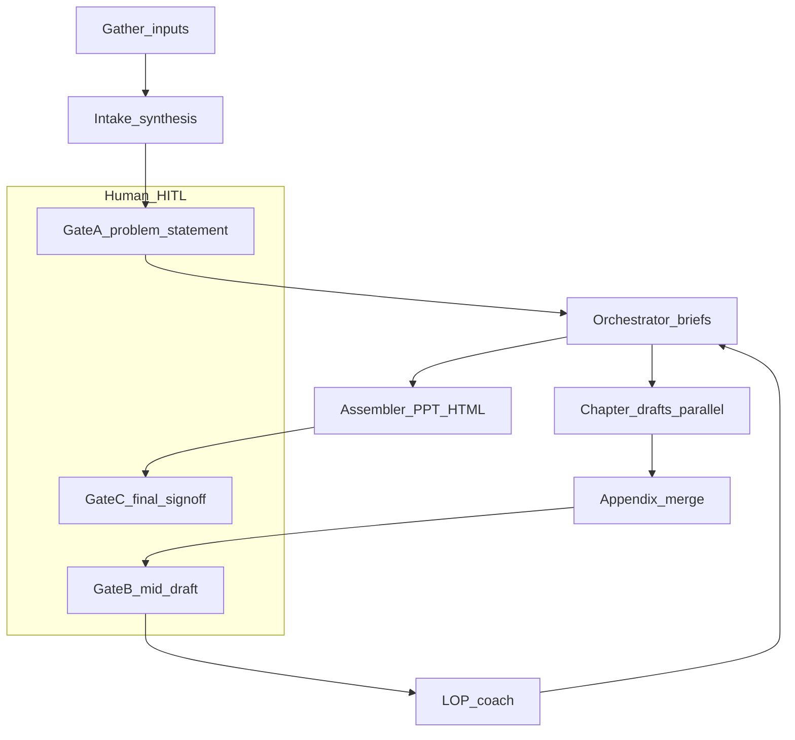
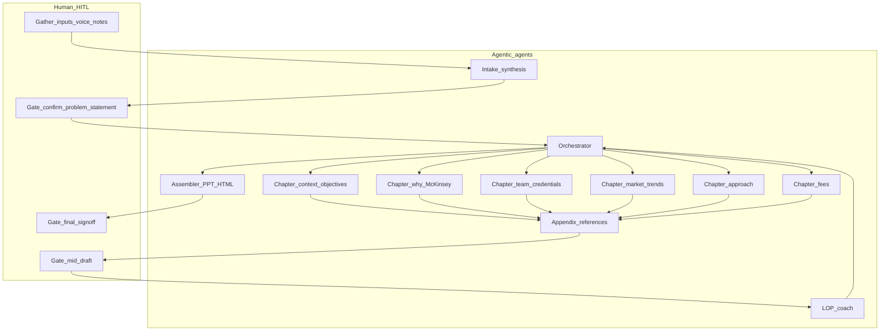

# Draft: LoP agent workflow (living document)

**Status:** DRAFT — personal working copy under Jasper. **Not** firm policy or a substitute for program sign-off. Iterate here before promoting changes to project rules or team documents.

**Goal:** Speed high-standard **LoP** (Letter of Proposal) generation; gather **CST** and **client** input; outputs may include **PPT and/or HTML**. Use only tools and sources your environment actually provides.

---

## Purpose

- **Bridge** the full multi-agent design ([`LOP-agent-workflow.md`](../LOP-agent-workflow.md)) with day-to-day use in a **single Cursor chat** or light handoffs.
- **Iterate** workflow wording, checklists, and gate criteria here without editing [`.cursor/rules/`](../../../.cursor/rules/) or [AGENTS.md](../../../AGENTS.md) until you choose to promote a version.
- **Pair** with a per-pursuit tracker: start from [`lop-build-tracker.md`](../templates/lop-pursuit-template/lop-build-tracker.md) (copy the whole [`lop-pursuit-template`](../templates/lop-pursuit-template/) folder per pursuit under `Jasper/`) and keep **Ready / TBD / Owner** and open issues there.

---

## Source of truth hierarchy

1. **RFP / tender** and **gold examples** the squad supplies — structure and must-haves.
2. **Problem statement and assumptions** after **HITL gate A** — no chapter drafting against a rejected problem frame.
3. **Per-chapter briefs** from the orchestration step — objectives, tone, must-include / must-not, evidence rules.
4. **LOP coach** and **Assembler** — flag gaps and structure output; **do not** introduce new facts or unsupported claims.

---

## Chapter spine (default ToC)

Unless the RFP or a gold example dictates otherwise, use this spine. In your tracker, mark each row **Ready / TBD / Owner**.

| # | Chapter | Ready / TBD / Owner |
|---|---------|---------------------|
| 1 | Context & objectives | |
| 2 | Why [Marketing] *(or relevant function — confirm label)* | |
| 3 | Timeline and team *(60/30 or firm staffing notation if supplied)* | |
| 4 | Team | |
| 5 | Credentials | |
| 6 | Market trends | |
| 7 | Approach | |
| 8 | Fees | |
| 9 | Appendix | |
| 10 | References | |
| 11 | Team CVs | |

**Default cadence (from project workflow rule):** Divide work → Information gathering → Identify gaps → Review / iterate.

**Data gathering pipeline:**

```text
Voice inputs (e.g. Zoom) → Synthesizing → Problem statement
  → Draft output (clarifying questions, client feedback)
  → Feedback loop → Final output (PPT / HTML)
```

- **Synthesizing:** one-page problem statement + win themes before long prose.
- **Draft:** clarifying questions inline or in a single Q block.
- **Feedback loop:** track decisions and superseded text; do not silently drop partner edits.

**Coordination:** Tag inputs by role (partner, CST, BD, expert); flag conflicts for human resolution — do not merge opposing views silently.

---

## End-to-end flow

### Conceptual (multi-agent / program view)

1. Human data gathering (including short voice-style inputs) → **Intake & synthesis** → problem statement, assumptions, numbered questions.
2. **HITL gate A** — Squad confirms problem statement; resolves **opposing inputs** or records Option A / B for explicit partner decision.
3. **Orchestrator** — Chapter briefs; open-issues log; merge rules.
4. **Chapter agents** — Draft in parallel where dependencies allow (approach grounded in problem statement; “why us” bounded by evidence rules).
5. **Appendix & references** — Merge citations; flag gaps.
6. **HITL gate B** — Human pass on direction and missing inputs.
7. **LOP coach** — Full draft + source index → issue list by chapter; no unilateral fact rewrites.
8. **Revision** — Apply **only** human-approved fixes from coach output (per-chapter vs single revision pass: **TBD**).
9. **Assembler** — Integrated narrative + PPT/HTML handoff spec.
10. **HITL gate C** — Final sign-off before send.

**Canvas mapping:** Workplan (Orchestrator) → information gathering (Intake) → identify agents → divide work (parallel chapters) → draft/revise → review/iterate (LOP coach + gates).

### Practical: single-session checklist (one chat, sequential turns)

Use this when you are not running separate agent runtimes — each row is a **deliverable** you can ask for in one conversation.

| Step | Logical role | Ask for / deliverable |
|------|----------------|------------------------|
| 1 | Human + Intake | Paste raw notes, transcripts, voice summaries; output: **problem statement**, **assumptions list**, **numbered clarifying questions**. |
| 2 | Human (Gate A) | Confirm or edit problem statement; resolve conflicts; record decisions in tracker. |
| 3 | Orchestrator | **Chapter briefs** (objectives, tone, must-include/must-not, evidence rules) + **open-issues log**. |
| 4 | Chapter drafters | For each spine section (or batched): draft + **source placeholders**; fees = **TBD** where numbers/terms missing; credentials only from supplied material. |
| 5 | Appendix | **Consolidated sources / bibliography** from chapter lists. |
| 6 | Human (Gate B) | Direction check; approve or defer missing inputs; update tracker. |
| 7 | LOP coach | **Issue list by chapter** (completeness, consistency, unsupported claims, tone, risk). |
| 8 | Revision | Re-draft only **approved** fixes; preserve source discipline. |
| 9 | Assembler | **Outline / slide map / HTML structure** + cross-refs as needed. |
| 10 | Human (Gate C) | Final sign-off. |

---

## HITL gates

### Gate A — Confirm problem statement

| | |
|--|--|
| **Inputs** | Intake output: problem statement, assumptions, clarifying questions; any CST/client/partner fragments. |
| **Exit criteria** | Squad-aligned problem statement; **opposing inputs** resolved or explicitly branched (Option A/B) with a recorded owner/decision — not merged silently. |
| **Tracker / log** | Lock “Problem statement v#”; log resolved questions; note deferred items with owners. |

### Gate B — Mid-draft direction

| | |
|--|--|
| **Inputs** | Full first integrated draft; merged appendix/source list; open-issues log from orchestration. |
| **Exit criteria** | Human pass on narrative direction; missing inputs either supplied, explicitly TBD with owner, or cut with rationale. |
| **Tracker / log** | Update per-chapter **Ready / TBD / Owner**; refresh clarifying Q block if new gaps appeared. |

### Gate C — Final sign-off

| | |
|--|--|
| **Inputs** | Coach-reviewed, revised draft; Assembler output (structure / PPT-HTML spec). |
| **Exit criteria** | Named approver(s); packaging ready for send; no undocumented new claims since Gate B. |
| **Tracker / log** | Final version id; send checklist (format, recipients) as your process requires. |

---

## Risk hooks (abbreviated)

| Risk | Mitigation |
|------|------------|
| **Hallucination** | Coach flags unsupported claims; “why us” uses evidence-linked bullets only; Assembler does not add new facts. |
| **Wrong prior / wrong input** | Intake publishes **assumptions**; briefs tag source-of-truth per chapter; Gates A/B catch gaps early. |
| **Opposing inputs** | Gate A resolution or explicit Option A/B + recorded human decision — never silent merge. |

---

## Control flow (simplified)

High-level view for quick alignment. For the full chapter-level diagram, see [`LOP-agent-workflow.md`](../LOP-agent-workflow.md).



---

## Full control flow (reference — same as program doc)



---

## Open decisions (checklist — edit as the program decides)

Program-level TBDs carried from the agent workflow design:

- [ ] Orchestrator: mostly prompts + human PM vs. partial automation.
- [ ] Single **revision** pass vs. per-chapter revision after coach.
- [ ] Source index format for audit (table vs. footnotes vs. tool-specific).
- [ ] Structured intermediate format (e.g. JSON between agents) if/when integrations land.

**Evaluation (from canvas):** Baselines and measurement methods for win rate, time saved, quality, time spent, audit — **TBD** by the team.

---

## Related links

| Artifact | Path |
|----------|------|
| Multi-agent program design (roster, principles) | [../LOP-agent-workflow.md](../LOP-agent-workflow.md) |
| Project agent instructions | [../../../AGENTS.md](../../../AGENTS.md) |
| LoP build tracker *(per pursuit; bundled in template)* | [../templates/lop-pursuit-template/lop-build-tracker.md](../templates/lop-pursuit-template/lop-build-tracker.md) |
| Cursor rules — core stance | [../../../.cursor/rules/lop-builder-core.mdc](../../../.cursor/rules/lop-builder-core.mdc) |
| Cursor rules — spine & pipeline | [../../../.cursor/rules/lop-builder-workflow.mdc](../../../.cursor/rules/lop-builder-workflow.mdc) |
| Cursor rules — tools & data | [../../../.cursor/rules/lop-builder-tools-data.mdc](../../../.cursor/rules/lop-builder-tools-data.mdc) |

---

## Optional development workstreams (proposal only — not team-approved)

If useful for planning: (1) Product & chapter model (2) Workflow & HITL (3) Knowledge & data (4) Tooling & integrations (5) Quality & LOP coach (6) Demo & faculty narrative.
