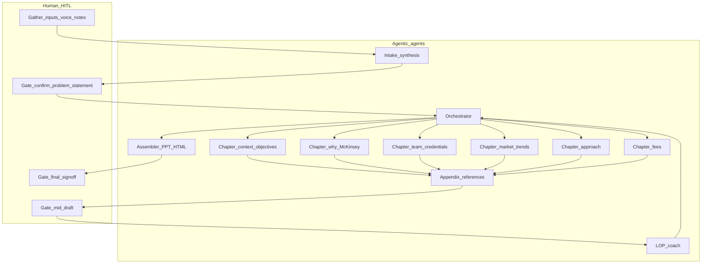

# LOP generation: agentic agent workflow

Program anchor (from Agent Design Canvas; do not treat this file as firm policy). Goal: speed high-standard **LOP** (Letter of Proposal) generation; gather **CST** and **client** input; outputs may include **PPT and/or HTML**. Tools mentioned on canvas include: LOP coach, office formats, connections to Know/MVI where available, web, voice-to-text, email—**use only what your environment actually provides**.

This document defines a **multi-agent workflow** the team can implement: roles, handoffs, human gates, and risk hooks.

---

## Design principles

1. **Thin orchestrator** — Owns sequencing, merges inputs, escalates when humans must resolve ambiguity (especially **opposing inputs**).
2. **Specialist agents** — One primary job each so prompts stay narrow (reduces **hallucination** and **wrong prior / wrong input**).
3. **Explicit HITL gates** — After synthesis, after first integrated draft, and before final packaging.
4. **LOP coach separate from drafters** — Critic pass for accountability and auditability; no silent invention of facts.

---

## Agent roster

| Agent | Role | Primary inputs | Output |
|--------|------|----------------|--------|
| **Orchestrator** | Workplan, chapter order, tasking, merge decisions, escalation | User goals, squad-approved problem statement, constraints you supply | Run-of-show; per-chapter briefs; open-issues log |
| **Intake & synthesis** | Consolidate CST/client/partner/market fragments and short voice notes | Raw notes, transcripts, prior-work summaries if available | Problem statement; assumptions list; numbered clarifying questions |
| **Chapter — context & objectives** | Scope, objectives, success criteria | Synthesized intake | Draft section + source placeholders |
| **Chapter — why McKinsey** | Value proposition; “have we done this before?” style proof **only from supplied evidence** | Credentials, past engagements, approved claims | Draft section + explicit “evidence required” flags |
| **Chapter — team & credentials** | Team narrative; pointers to bios | CV snippets, role descriptions | Draft section + CV appendix checklist |
| **Chapter — market / context** | External context, trends | Web/market inputs **if** allowed; internal summaries | Draft + citation/source list |
| **Chapter — approach** | Method, workplan, governance | Problem statement, scope | Draft section *(v0.1 Cursor runbook: **outline / questions** until partner-approved scope — see [`lop-cursor-runbook.md`](./lop-cursor-runbook.md))* |
| **Chapter — fees** | Commercial framing | Approved commercial inputs | Draft; **TBD** where numbers or terms are not supplied |
| **Appendix & references** | Sources, references, appendices | Source lists from chapter agents | Consolidated appendix / bibliography |
| **LOP coach** | Rubric: completeness, consistency, supported claims, tone, risk flags | Full draft + source index | Issue list by chapter; **no** unilateral rewrite of facts |
| **Assembler** | Contents table, cross-refs, packaging spec for PPT/HTML | Coached, human-approved draft | Final structure; handoff spec for PPT/HTML (format **TBD** by tooling) |

**Optional splits** (only if the team wants finer control): RFP/tender parser agent; style agent for competitive vs non-competitive LOPs fed by **your** exemplars—not invented positioning.

---

## End-to-end process

1. **Human data gathering** (including ~7 min voice-style inputs) → **Intake & synthesis** produces problem statement, assumptions, questions.
2. **HITL gate A —** Squad confirms problem statement; resolves **opposing inputs** or records competing versions for explicit partner decision.
3. **Orchestrator** issues chapter briefs (objectives, tone, must-include / must-not, evidence rules).
4. **Chapter agents** draft in parallel where dependencies allow (e.g. approach after problem statement; “why McKinsey” can parallel market if evidence boundaries are clear).
5. **Appendix & references** merges citations and checks for gaps.
6. **HITL gate B —** Human pass on direction and missing inputs.
7. **LOP coach** runs on full draft + source index.
8. **Revision** — Either per-chapter agents or one revision pass applies **only** human-approved fixes from coach output (team choice **TBD**).
9. **Assembler** produces integrated narrative + PPT/HTML structure.
10. **HITL gate C —** Final sign-off before send.

**Footer workflow mapping (from canvas):** Workplan (Orchestrator) → information gathering (Intake) → identifying agents (roster above) → divide work (parallel chapters) → work on elements (draft/revise) → review/iterate (LOP coach + gates).

---

## Mermaid: control flow

---

## Risk hooks

| Risk | Workflow mitigation |
|------|----------------------|
| **Hallucination** | Coach flags unsupported claims; “Why McKinsey” agent outputs evidence-linked bullets only; Assembler does not add new facts. |
| **Wrong prior / wrong input** | Intake publishes **assumptions**; Orchestrator tags each chapter with source-of-truth; Gate A/B catch gaps early. |
| **Opposing inputs** | Resolved at Gate A or explicitly branched (e.g. Option A vs B) with a recorded human decision—not merged silently. |

---

## Evaluation touchpoints (from canvas)

Track against team metrics where defined: win rate, time saved, quality of output, time spent, audit. **Baselines and measurement methods — TBD** by the team.

---

## Open decisions (TBD)

- Orchestrator: mostly prompts + human PM vs. partial automation.
- Single **revision** agent vs. per-chapter revision after coach.
- Source index format for audit (table vs. footnotes vs. tool-specific).
- Structured intermediate format (e.g. JSON between agents) if/when you add integrations.

---

## Optional parallel workstreams (chat proposal — not team-approved)

If useful for **development** planning only, label as proposal: (1) Product & chapter model (2) Workflow & HITL (3) Knowledge & data (4) Tooling & integrations (5) Quality & LOP coach (6) Demo & faculty narrative.
